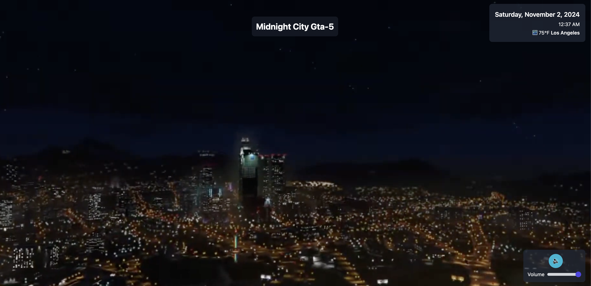
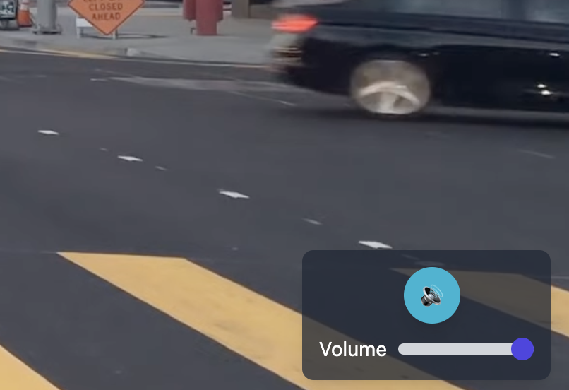
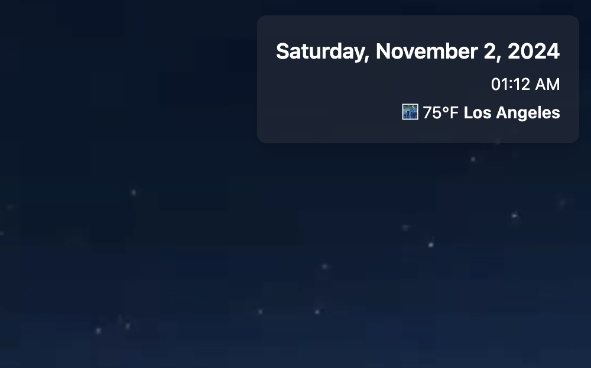

# 🌃 Los Angeles Drive

---

## Basic Details

### **Team Name:** 
**Los Angeles Drive**

### **Team Members**
- **Team Lead:** Joe George  
  *St. Joseph's College of Engineering and Technology, Palai*

## **Note:** 
- #### 🔴Enable "Audio" and Autoplay" on the website for good experience
- #### There is an additional webpage to the project. I meant for the 2nd webpage to be an easter egg but I don't want it to go unnoticed. Click on the "Los Santos Gta-5" text on the first webpage to go to a night-themed Webpage.
- #### AI tools have been utilized in the development of this project to enhance functionality and user interaction
  
---

### **Project Description**
The Los Angeles Drive project provides a virtual driving experience through the scenic streets of Los Angeles. Users can immerse themselves in a live POV journey while enjoying the nostalgic soundtrack of "Lady Hear Me Tonight." This unique combination aims to evoke memories of the beloved game GTA5, transforming an ordinary viewing experience into an extraordinary adventure! 
Click on the heading in the Website for a surprise✨.

---

### **The Problem (that doesn't exist)**
In a world filled with mundane video content, many viewers yearn for excitement and immersion. The typical video experiences fail to transport users to a vibrant, engaging environment that offers both visual and auditory stimulation.

---

### **The Solution (that nobody asked for)**
This project delivers a captivating virtual ride through Los Angeles, blending stunning visuals with an iconic soundtrack. By creating an engaging experience that resonates with fans of GTA5, we aim to bring joy and nostalgia to viewers, making every moment spent watching feel like an exhilarating drive through the city.

---

## Technical Details

### **Technologies/Components Used**
**For Software:**
- HTML5
- CSS3
- Javascript
- Tailwind Framework
- Cloudflare
- Github Pages
- YouTube API
- VS Code

**Deployments:**
- [Cloudflare](https://los-angeles-drive.pages.dev)
- [Github Pages](https://joegeorge022.github.io/Los-Angeles-Drive/)
  
---

### **Implementation**
For Software: 
The Project is deployed as a website which can be viewed by clicking [here](https://joegeorge022.github.io/Los-Angeles-Drive/) or [here](https://los-angeles-drive.pages.dev/).

---

## Project Documentation

### **Screenshots**
  
*User interface of the Los Angeles Drive project, showcasing the driving video and interactive controls.*

  
*Night-themed Los Angeles drive, highlighting the music video "Midnight City, Gta-5."*

  
*Volume control and play/pause buttons, designed for a sleek and user-friendly experience.*

  
*Current time and weather display, providing users with real-time updates as they enjoy their drive.*

---

## **Videos Used**
- [Midnight City Music Video](https://youtu.be/D_4S4mT3xG0?si=ieAESdp9XJ2YZlch)  
- [Los Angeles 4K Night Drive](https://youtu.be/WL-xeM0RD7E?si=H8TjNcDeD-GgeKWT)  
*These videos are embedded in the site.*

---

## **Team Contributions**
- Not Applicable

---

Made with ❤️ at TinkerHub Useless Projects 

 

[SJCET Tinkerhub](https://www.tinkerhub.org/campus/2165/St.%20Josephs%20College%20of%20Engineering%20and%20Technology,%20Choondacherry)
---
